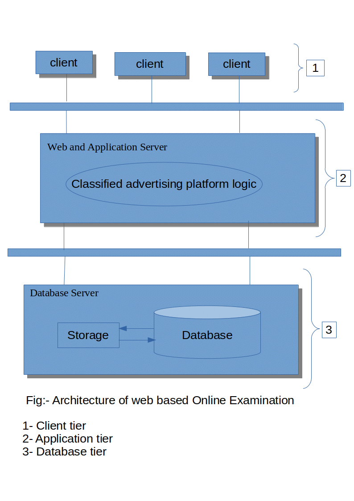

# TRIBHUWAN UNIVERSITY 

# PURWANCHAL CAMPUS 

# TINKUNE, DHARAN 

# A 

# PROJECT PROPOSAL 

# ON 

# CLASSIFIED ADVERTISING PLATFORM (SASTOSAAMAN) 

# SUBMITTED TO 

# DEPARTMENT OF ELECTRONICS AND COMPUTER ENGINEERING 

 

# SUBMITTED BY: 

# ANISH JOSHI (anishjoshi1999@gmail.com) 

# SUJAN KARKI (sujankarki269@gmail.com) 

# NIRUTA DIMAL (nirutadhimal7@gmail.com) 

# PRADIP SAPKOTA (mr.prasag@gmail.com) 

# FEB 15, 2021 

 

# Acknowledgement 

We are thankful to all those who have helped us directly or indirectly with this project. Foremost, we would like to thank purwanchal campus for providing us this project, “Classified Advertising platform (SastoSaaman)”.We would like to thank Er. Pravin Sangroula for his guidelines for this project and for organizing this course and acknowledge his effort that encouraged us to take this challenging project. We would also like to offer our gratitude to all our teachers whose lectures and ideas were the basis for our project research and appreciate the support rendered by Department of Computer Engineering, ERC. 

# Abstract 

The project entitled “Classified Advertising platform (SastoSaaman)” is a website for buying and selling items. Classified advertising is a form of advertising, particularly common in newspapers, online and other periodicals, which may be sold or distributed free of charge. Classified advertisements are much cheaper than larger display advertisements used by businesses. SastoSaaman is a free classifieds and online marketplace that helps users to sell, buy or discover anything across Nepal. This project is the combination of Online market place and Online Classified Advertising platform.Community members can come to our site to sell their old car, bike, music system, laptop or furniture,buy any item that they might want or have to offer and make new friends while doing all of the above. 

# TABLE OF CONTENTS 
# Abstract ............................................................... i 
# Acknowledgement ................................................................. ii 
# List of Figures .......................................................................... iv 
# 1 Introduction ................................................................... 1 
# 2 Objective and scope ......................................................... 2 
# 2.1 Objectives ........................................................................... 2 
# 2.2 Scope ............................................................................... 2 
# 3 Literature Review .................................................................. 3 
# 3.1 Background ............................................. 3 
# 3.2 Existing Situation .............................................. 3 
# 3.2.1 Proposed system
# 3.3 NodeJS(Javascript) ......................................................... 4 
# 3.4 MONGODB ............................................................. 5 
# 3.5 Express.js.......................................................................... 5 
# 3.6 React.js..................................................................... 5 
# 3.6 E-R diagram ............................................... 6 
# 3.7 System Environment .................................... 7 
# 3.7.1 Hardware requirements ....................... 7 
# 3.7.2 Software requirements ....................................... 7 
# 4 Design Diagrams .................................................... 8 
# 4.1 Use Case Diagram ........................................ 8 
# 4.1.1 Use Case Diagram for XYZ ........................... 8 
# 4.1.2 Use Case Diagram for ABC .............................................................................. 9 
# 4.1.3 Use Case Diagram for EFG .......................................................................10 
# 5 Feasibility Study ...........................................................11 
# 5.1 Technical Feasibility ......................................................11 
# 5.2 Economic Feasibility ...................................................11 
# 5.3 Operational Feasibility ...........................................12 
# 6 Architecture of CLASSIFIED ADVERTISING PLATFORM .........................13 
# 7 Project Schedule .............................................................14 
# 8 Conclusion ..........................................................................15 
# 9 References ............................................................16 iv 

# List of Figures and Graphs 

Figure 1: E-R Diagram …........................................ 

Figure 2: System Block Diagram ……………………………………………………………………………………………. 

Figure 3: XYZ……………………………………………………………………………………………………….. 

Figure 4: ABC …………………………………………………………………………………………. 

Table 1: Project Tools …………………………………………………………………………………………………………… 

Table 2: Cost Estimation ………………………………………………………………………………………………………… 

# 1.Introduction(new)

Classified advertising is a form of advertising which is particularly common in newspapers, online and other periodicals, e.g., free ads on papers. Classified advertising allows private individuals (not simply companies or corporate entities) to try to sell products or services. Classified advertising is called that because it is generally grouped within the publication under headings classifying the product or service being offered (headings such as electronics, Automobiles, Clothing, For Sale, For Rent, etc.) and is grouped entirely in a distinct section of the periodical, which makes it distinct from display advertising, which often contains graphics or other art work and which is placed near to editorial content. 

Newspapers are continuing to make less and less money from classified advertising because more and more people are using the Internet now and fewer people are reading newspapers. 

Online classified advertising is one of the fastest-growing types of online advertising. Online classifieds are all about buying and selling a range of goods and services. Online classifieds could be categorised into automobiles, furniture, matrimony, recruitment, real estate, etc. 

Online classifieds could be of two types: Horizontal and Vertical. The horizontal classifieds include different products ranging from furniture, electronics, apparels, etc. The vertical classified is restricted to a single platform for instance LinkedIn which advertises different jobs and vacancies. 

The online classified market is expected to increase due to growth in the retail e-commerce industry, increase in a number of smartphone users, increasing internet penetration, growing global youth population, etc. Yet the market faces some challenges such as, need for technological barriers, developing country barriers, social media threat, etc. As the online classified advertising sector develops, there is an increasing emphasis toward specialization. 

# 2 Objective and scope
This encloses the needs and scope of the development of the project. The objectives can be explained as following:
# 2.1	Objectives
1    To make buying and selling of secondhand items easy and convenient.
2    To connect interested buyers and sellers.
3.   To provide information about various products in a different category.
4.   Customer can login and get various information about products and can purchase a suitable product with price and quality comparison.
5.   Customer can login and post information about the products they want to sell.
# 2.2 Scope
1.  Customers can buy and sell products online.
2.  This can be used as online marketplace and classified advertising platform.
3.  Buyers and Sellers are connected and  transaction are done through this site, this reduces the chances of fraud and scam.

# 3 Literature Review 
# 3.1 Background 
      Classified Advertising Platform (Sasto Saman) app need to be extremely fast with high performance, so we use React for this. Such app will grow over time so instead of building one big monolithic app will separate it into two different parts: client side and server side. In server side, we will use NodeJS and MongoDB to build our API. In client side, we will use React and Redux for building the frontend. The benefit of this approach is, you can either work in client side or server side independently. Later on, if you decide to use some other framework to build your front end, you can still use the same backend. And even if you decide to build mobile app later, you can still use the same backend API for that.
 
# 3.2 Existing Situation 
•	Normally we have seen web app filled with app everywhere .
•	The  existing web app user interface make it difficult to use for some of the users
•	The user interface do not have a clean interface and require better maintenance to get the desired outcomes

# 3.2.1 Proposed system
•	Focusing on the problems in the existing system, the new system provides user friendly interface with high flexibility in using this application.
•	As a platform owner, the interface contains less ads.
•	As per the security concerned, all the user’s information is maintained secured.
•	This application is suitable for all sort of platforms available in the market.

# 3.4 MongoDB
            MongoDB is a NoSQL database where each record is a document comprising of key-value pairs that are similar to JSON (Java Script Object Notation) objects. It is flexible and allow its users to create schema, databases, tables, etc. It is extremely easy to use and ultimately scalable solution for modern apps.  It is very easy to perform database queries with MongoDB compared to other databases like firebase, etc.

# 3.5 Express
           Express is Node.js framework. Rather than writing code using Node.js and creating loads of Node modules, Express makes it simpler and easier to write the back-end code. Express helps in designing great web applications and APIs. It supports many middleware which makes the code shorter and easier to write. Express promotes code reusability with its built-in router. It has biggest community for Node.js.

# 3.6 React JS
       React is a JavaScript library that is used for building user interfaces. React is used for the development of single-page applications and mobile applications because of its ability to handle rapidly changing data. It allows users to code in JavaScript and create UI components. Features like Virtual DOM, JSX and Components make it much faster than rest of the framework out there.

# 3.7 Node.js
           Node.js provides a JavaScript Environment which allows the user to run their code on the server (outside the browser). It is open source JavaScript Runtime Environment. Node pack manager i.e. npm allows the user to choose from thousands of free packages (node modules) to download. It follows single threaded model. It is built on Google Chrome’s JavaScript Engine, so it has fast code execution and is highly scalable.

# 3.8 ER diagram(To be done later)

# 3.9 System Environment
      For design and development given system environment is required.

# 3.9.1 Hardware Requirements
           Processor:                             1.8 GHz Dual-Core Intel Core i5 and above
           Hard Disk Drive:                       50 GB or above
           Monitor:                               LCD Monitor
           Keyboard:                              USB
           Mouse:                                 USB optical
           RAM:                                   4 GB or above

# 3.9.2 Software Requirements
           Front End:                             React JS
           Back End:                              Node.js and MongoDB
           Operating System:                      Windows 10/Ubuntu/MacOS 
           Language:                              JavaScript (MERN Stack)
           Documentation:                         MS-WORD/EXCEL/PowerPoint
           Interface of Programming:              Visual Studio Code

# 4 Design Diagrams 
# 4.1 Use Case Diagram 
# 4.1.1 Use Case Diagram for XYZ 
# 4.1.2 Use Case Diagram for ABC 
# 4.1.3 Use Case Diagram for EFG
   
# 5.FEASIBILITY ANALYSIS
For the system that is to be developed must satisfy all the feasible strategy.This step deals with the various types of the feasibilities that are needed to be considered during the system development. Mainly there are different types of feasibility that are needed to be considered and they are:
# 5.1 Technical feasibility
The necessary technology to develop our project "CLASSIFIED ADVERTISING PLATFORM ". Software like Node.js and MongoDB can be used to develop the back end which contains the actual database in which various information are stored which can be manipulated or retrieved as per the requirement. React.js front-end framework can be used to develop a user friendly interface to be used by the system user. Therefore the project team feels it is capable of making use of the available technology to build "CLASSIFIED ADVERTISING PLATFORM" website. Hence the system is technically feasible.
# 5.2 Economic Feasibility 
For any system if the expected benefits equal or exceed the expected costs, the system can be judged to be economically feasible. In economic feasibility, cost benefit analysis is done in which expected costs and benefits are evaluated. Economic analysis is used for evaluating the effectiveness of the proposed system.

Developing an IT application is an investment. Since after developing that application it provides the organization with profits. Profits can be monetary or in the form of an improved working environment. However, it carries risks, because in some cases an estimate can be wrong. And the project might not actually turn out to be beneficial.
Cost benefit analysis helps to give management a picture of the costs, benefits and risks. It usually involves comparing alternate investments.
Cost benefit determines the benefits and savings that are expected from the system and compares them with the expected costs.
The cost of an information system involves the development cost and maintenance cost. The development costs are one time investment whereas maintenance costs are recurring. The development cost is basically the costs incurred during the various stages of the system development.
(source: https://www.freetutes.com/systemanalysis/sa3-cost-benefit-analysis.html)
# 5.3 Operational Feasibility
Operational feasibility is mainly concerned with issues like whether the system will be used if it is developed and implemented. Whether there will be resistance from users that will effect the possible application benefits? The essential questions that help in testing the operational feasibility of a system are following.

Does management support the project?

Are the users not happy with current business practices? Will it reduce the time (operation) considerably? If yes, then they will welcome the change and the new system.

Have the users been involved in the planning and development of the project? Early involvement reduces the probability of resistance towards the new system.

Will the proposed system really benefit the organization? Does the overall response increase? Will accessibility of information be lost? Will the system effect the customers in considerable way?
(source:https://www.freetutes.com/systemanalysis/sa3-technical-economic-operational-legal.html)
# 6 Architecture of CLASSIFIED ADVERTISING PLATFORM

# 7 Project Schedule 
# 8 Conclusion 
# 9 References 

